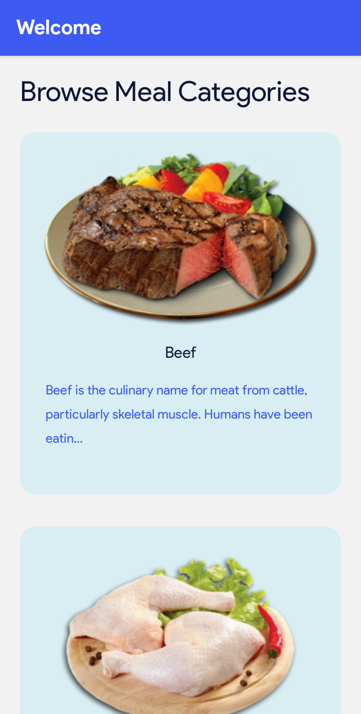
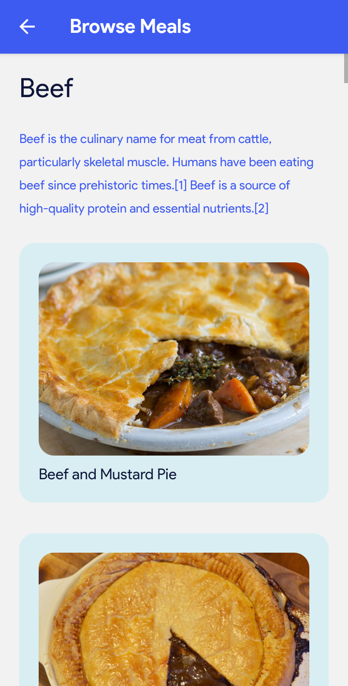
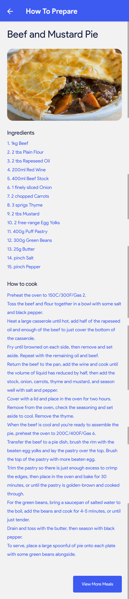

# CookEase Mobile App

| Homepage                                     | Meals Page                                   | More Details Page                              |
| -------------------------------------------- | -------------------------------------------- | ---------------------------------------------- |
|  |  |  |

This is a mobile culinary app that uses [TheMealDB API](https://themealdb.com) to get meal categories, recipes, ingredients, and all the information on the app.

The app is build using React Native and Expo.

## How To Run

1. Open a terminal window and clone the repository using `git clone https://github.com/sankthomas/my-nhif-mobile-app.git`.
2. Still within your terminal, CD into the folder using `cd cookease-mobile-app`.
3. Run `npm install` to install all relevant dependencies for the project.
4. Check the `package.json` file for the scripts you can run during development.

## Routing

Routing is done using native stack navigation in React Native.

## Fonts

This project uses the Product Sans font.

## Colors

1. Purple: #3d5af1 (text)
2. Dark purple: #0e153a (headings and other dark text)
3. Light blue background: #22d1ee20
4. White: #ffffff (Statusbar headings)
